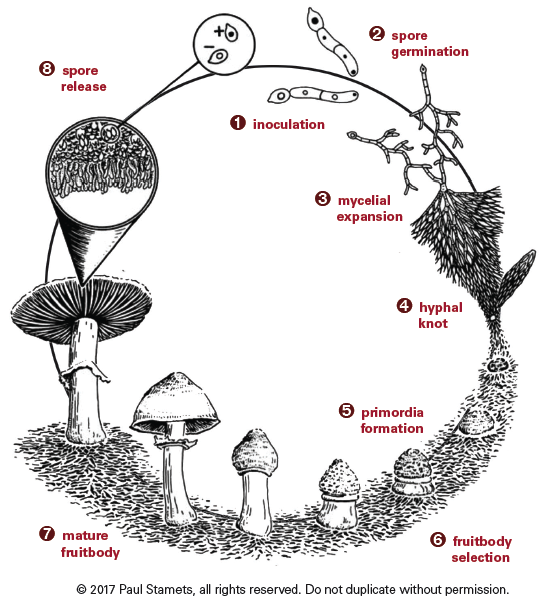
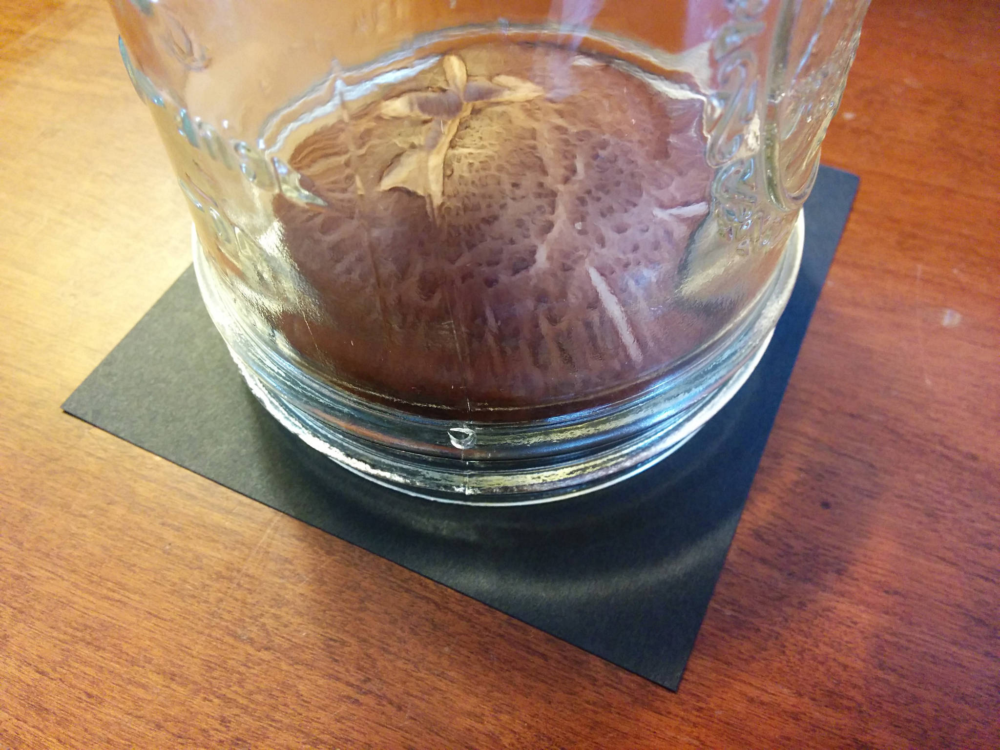
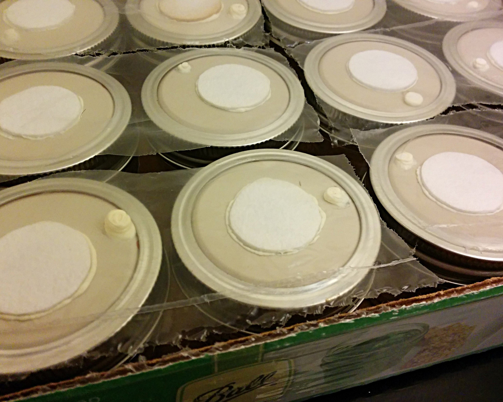
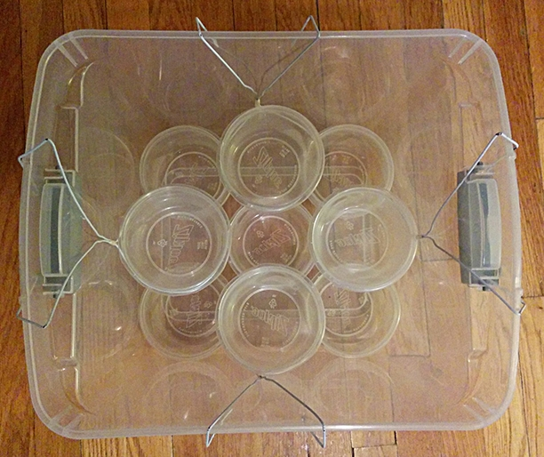

# Introduction

The scientific literature on cultivating mushrooms for food typically seeks to establish the relative yield potential of oyster mushrooms on fibrous industrial refuse such as bagasse, newspapers, and tree stumps.
The peculiar history of American cultivation had pioneers such as Oss and Oeric cast *P. cubensis* as the type species for "kitchen" methods.

As far as I know, there is no straightforward algorithmic approach to home cultivation written with professional biologists in mind.
This paper describes a simple method that doesn't require you to recreate a lab environment at home: tissue culture → fermenting aerobically → inoculating substrate.

## Security notice

Gourmet mushrooms are relatively new to Commonwealth cuisine and medicine compared to those of nations such as France, Italy, Russia, and Japan.
As a result of this and the success of the 1970s pioneers, nearly everyone in the U.S. from the man on the street to the DEA policymaker assumes psychoactives at the words "mushroom cultivation."

Information from websites like the [Shroomery](https://www.shroomery.org/forums/) usually fails to account for personal security and describes inappropriate methods for urban gourmands who seek to implement a rotating closet garden.

The risks are real and significant because most species look like fuzzy white containers most of the time.
To the untrained eye, genuine and illicit are indistinguishable until fruitbodies appear.
Sequencing the ITS gene region can identify the vegetative mycelium.

Therefore you should pay cash in person and mail money orders *to* supplier *from* order number.
Rent a PO box and make every effort to decouple your name, address, and date of birth.
Use a passport as your first ID and an obsolete document as your second.
Always be aware of your actions' relative conspicuousness from many vantage points.
Mind your trash.

You can enjoy many delicious and healthy foods like bear's head, king tuber, mini shiitake, shaggy mane, and others that aren't otherwise available.
But only if you heed my security warning.

# Materials needed

## Culturing

- agar and malt extract
- dead air box or clear tote
- jelly and pint jars
- 25 qt pressure cooker
- toothpicks and cotton swabs
- ≥ 10 mL syringes and ≤ 18G needles (optional)

## Fruiting

- hardwood fuel pellets or coco coir
- ≥ 30 qt plastic totes
- polypropylene 5 pint containers
- wheat bran and/or other nitrogen

# Protocol

## Germinating spores

Increment the generation for 7--10 spore-to-shroom grows if you wish to domesticate a variety, e.g., donko (cracked cap) shiitake.
Working with spores is optional and usually unnecessary for most of the edible fungi you can acquire and cultivate at home.

One print to many germination plates is a good balance.
Take spores from a model specimen to advance the lineage.
Make many germination plates to ensure the fittest progeny in a diverse population.

To make a spore print, sever the mature cap, place it on foil under glass for 12--24 hrs, then fold it into more foil and store it in a plastic bag.

## Tissue culture

Increment [the Stamets P Value](http://www.fungi.com/blog/items/what-is-the-stamets-p-value-system.html) for each plate and always work with the genetically youngest copy.
Malt extract agar (MEA) selectively favors fungi at around pH 5.6 with a high peptone content.

Pour the media directly into jelly jars.
Loosen the lids or replace them with 0.22 μm filter disks.
Add optional inoculation ports.
Foil the lids and sterilize the jars in a pressure cooker for 15 min at 15 psi along with toothpicks, swabs, etc.
Raise the pressure cooker's floor and use twice the water so the agar doesn't boil over.
For 2 dozen jelly jars:

- 500 mL water
- 10g agar-agar
- 10g malt extract
- 1g peptone or yeast (optional)

There are many ways to acquire gourmet mushroom cultures for free.
Sanitize and tear apart foraged or purchased mushrooms within 1--2 days of harvesting.
Take flesh from inside the stem base and regenerate the culture on agar.
Trade colonized agar blocks with friends.

Swab spores in an *M* pattern and expect them to contaminate.
Spores are inherently dirty and it's important to transfer the best germination fast.
Once you have a clean, vigorous, and non-sectoring plate, refrigerate it for later reference.

## Fermenting aerobically

The MEA recipe above minus agar makes two pint jars with room to breathe.
Loosen and foil the lids, then sterilize the broth and supplies for 15 min.
Test the ferment on agar after 2--3 days.

Syringes and needles greatly help with inoculation.
Take up ≤ 1 mL sterile water, poke the colonized plate, and inject through a port.
Otherwise, manually transfer tissue and avoid the jar sides.

A healthy culture comes to resemble an amorphous ball near the bottom when left undisturbed, something of an imperfect fractal.
Gently swirl it 2--3× daily for up to 2 weeks at room temperature.

## Inoculating substrate

There are three kinds of mushrooms: woodlovers, shitlovers, and special cases such as mycorrhizae (e.g., chanterelles) and carnivores (e.g., cordyceps).
Hardwood fuel pellets sustain primary (e.g., shiitake) and secondary decomposers (e.g., reishi).
Coco coir sustains tertiary ones (e.g., shaggy mane).
Nonce substrates are beyond the scope of this guide.

I provide only a basic recipe.
Please see [Chapter 21 of *Growing Gourmet and Medicinal Fungi* by Paul Stamets](http://library.uniteddiversity.coop/Permaculture/Growing_Gourmet_and_Medicinal_Mushrooms.pdf) for specific substrate requirements and growth parameters by species.
The idea is to achieve the highest nutrient density per pint.
Household options include malt extract, nutritional yeast, flours and whole grains, dog food, bird seed, etc.
For 1 plastic pint round:

- 100g (2/3c) hardwood fuel pellets or coco coir
- 30g (1/3c) wheat bran and other supplements
- 5--7g (1 tsp) gypsum or sea salt
- your last coffee grounds (optional)

A 23 qt pressure cooker comfortably fits 12 pints of substrate.
This is 1 qt base, 2c supplement, and 2 tbsp salt per loosely packed load.
Hydrate the substrate to field capacity or when a small rivulet stops 1--2s after you tightly squeeze a sample.
Loosen and foil the lids, then sterilize for 90--120 min.

Use 10--20 mL inoculum per pint of substrate or just enough to avoid standing water.
Syringes and needles help.
Then tighten the lids, vigorously shake them, gently tap them down, and sanitize them with 70% EtOH.

Loosen the lids and incubate them at room temperature for 1 week past full colonization.
Shiitake requires +1 month to cure and form a protective brown skin.

## Fruiting and harvesting

Each 30 qt tub fits 9 pints: 5 in a quincunx on the bottom and 4 suspended with bent coat hangers above the dead spaces.
This is 1-1/8 gal hot-swappable substrate in < 1 ft3.
It concurrently accomodates nearly every instance you may wish to fruit.

Remove the colonized cakes and wash the containers.
Replace the cakes in clean containers, fill them with cold water, and seal them overnight.
Then drain the water, sanitize the containers, and put them in the tub.
Leave the tub's lid loose.

Give the mushrooms ≥ 12 hrs indirect light daily.
Add optional water to the containers halfway through flushes to 1 cm depth.
Fan out the tub if the caps get humidity splotches.
The cakes yield 2 flushes each; hydrate them before each flush.

Harvest the mushrooms as they mature by twisting and pulling at the base.
Be careful not to damage the substrate or leave too much flesh.
Sanitized scissors can help with fleshy species.

Contamination isn't a problem if you catch it early.
Dispose of the contaminated cake.
Empty the tub and sanitize it.
Remove the cakes, rise them with cold water, and spray them with 5% apple cider vinegar.
Wash and sanitize the containers, replace the cakes, and reassemble the tub.

## Recycling by-products

Crumble spent cakes, dehydrate them, and powder them.
Use it in garden topsoil or as a substrate supplement according to the mushroom's decomposition stage, e.g., 1°, 2°, or 3°.
 Use leftover broth as plant fertilizer.
Sterilize and save grain soak water for agar, broth, and substrate.
Incidentally, this method produces very little waste.
